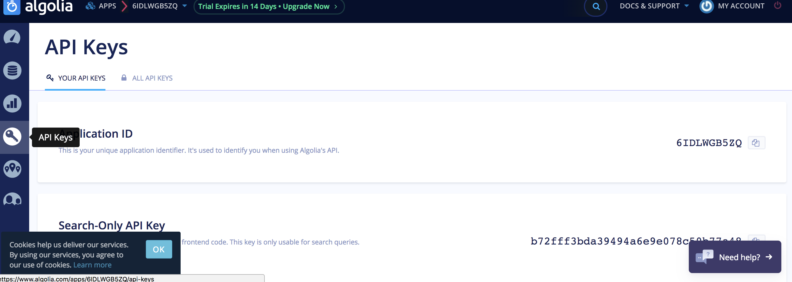

<script>
</script>
## 安装

### 安装node环境
官网下载 [node](http://nodejs.cn/download/)   http://nodejs.cn/download/

:::tip
npm随node一起安装,安装node后可以使用npm
:::

### 安装淘宝NPM镜像 cnpm

``` javascript
npm i -g cnpm
```


### 安装前端项目专用脚手架tydic-cli

``` javascript
npm i -g tydic-cli
```
或
``` javascript
cnpm i -g tydic-cli
```

### 通过模板构建项目

```html
tydic init <模板名称> [项目文件夹名称]
```
#### 例如构建组件开发项目:
```html
tydic init vue-component-base
```
### 配置

#### 文档配置
:::tip
组件菜单自动生成,其他菜单需要手动配置
:::
##### 顶部菜单(一级菜单)
添加menu  `doc/components/header.vue`

```html
   <!--//FIXME 顶部菜单 -->
        <ul class="nav">
          <li class="nav-item nav-algolia-search" v-show="isComponentPage">
            <algolia-search></algolia-search>
          </li>
          <li class="nav-item">
            <router-link
              active-class="active"
              :to="`/testHeader`">{{ langConfig.testHeader }}
            </router-link>
          </li>
          <!--//FIXME 顶部菜单end-->
```

添加路由`doc/route.config.js`

```javascript
const generateMiscRoutes = function () {
  // 测试添加顶部菜单
  let testHeaderRoute = {
    path: `/testHeader`,
    name: 'testHeader',
    component: load('testHeader')
  };

  return [testHeaderRoute];
};
```
添加中文名称`doc/json/component.json`

```html
 "header":{
    "testHeader":"测试顶部菜单"
  }
```
添加页面 `doc/pages/testHeader.vue`

顶部菜单和页面添加完成.
:::tip
系统默认包含一些页面,除默认页面可以通过删除`doc/pages/template/*.tpl`文件删除,componet.tpl页面强烈建议保留,不要更改.
:::

##### 左侧菜单(二级菜单)

添加路由`doc/route.config.js`

```javascript
const generateMiscRoutes = function () {
  // 测试添加顶部菜单
  let testHeaderRoute = {
    path: `/testHeader`,
    name: 'testHeader',
    component: load('testHeader'),
    children: [
          {
          // 二级菜单
          path: 'testChild',
          name: 'testChild',
          component: load('testChild')
        }
      ]
  };

  return [testHeaderRoute];
};
```
添加页面 `doc/pages/testChild.vue`

二级菜单和页面添加完成.

:::tip
包含二级菜单的页面结构可以参考`doc/pages/guild.vue`

:::
###组件分类页面下的二级菜单不能更改,但可以修改`build/json/nav.config.json`

```json
 {
    "name": "开发指南",
    "children": [
      {
        "path": "/installation",
        "name": "安装"
      },
      {
        "path": "/quickstart",
        "name": "快速上手"
      }
      //可以在此添加三级菜单,对应在mdsdoc/文件夹内构建相对于path的md文件
    ]
  }
```

#### 文档搜索

如果文档需要提供搜索功能需要在[algolia](https://www.algolia.com)注册账号

注册登录,点击钥匙图标,这里可以获取3个key: **`Application ID`**  `Search-Only API Key`  `Admin API Key`
</img>

在build/bin/目录下创建algolia-key.js文件,写入如下代码
```javascript
module.exports=module.exports.default = 'Admin API Key'
```
`Admin API Key`换成自己Admin API Key字符串

修改文件`doc/components/search.vue`

```vue
  initIndex(){
    const client = algoliasearch('Application ID', 'Search-Only API Key');
    this.index = client.initIndex('tydic-vue-component-base');
  }
```
修改`algoliasearch('Application ID', 'Search-Only API Key')`里面的`Application ID`和`Search-Only API Key`为自己的字符串

修改文件`build/bin/gen-indices.js`

```javascript
  const client = algoliasearch('Application ID', key);
```
修改`algoliasearch('Application ID', key)`里面的`Application ID`为自己的字符串


上传自己的组件文档数据到algolia:
```html
node build/bin/gen-indices.js
```


